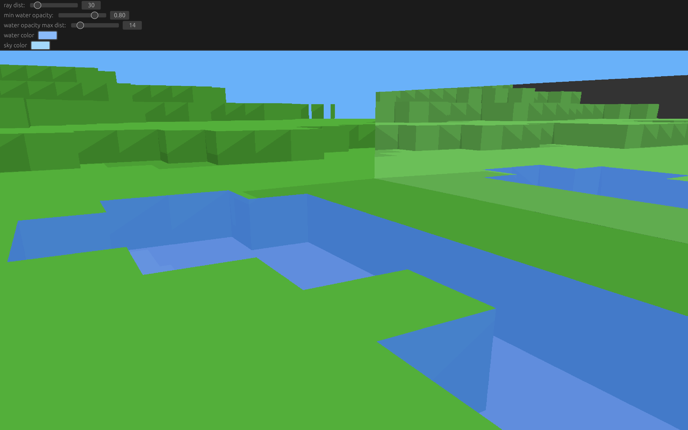
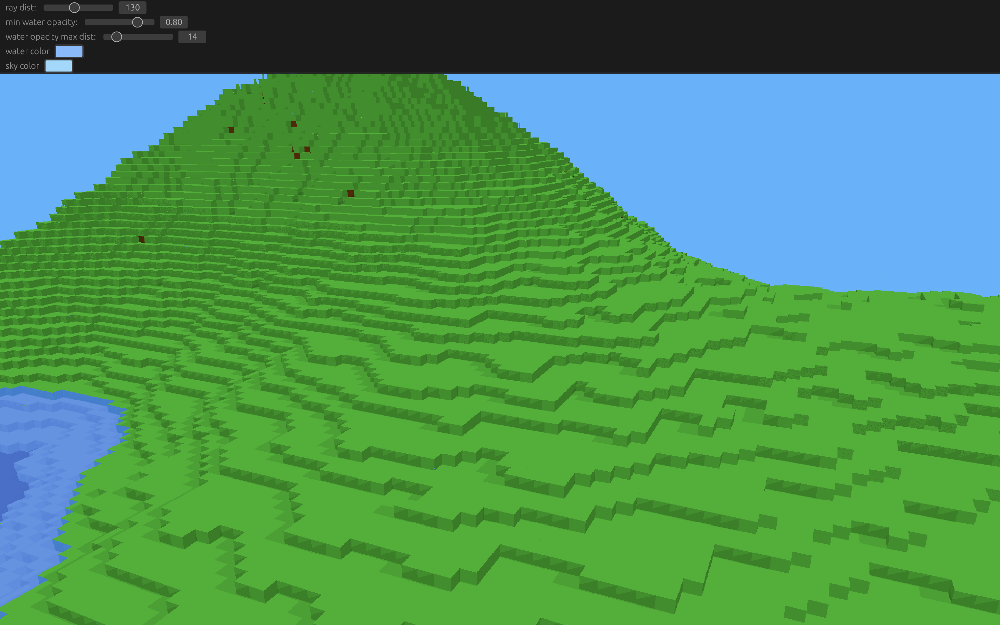
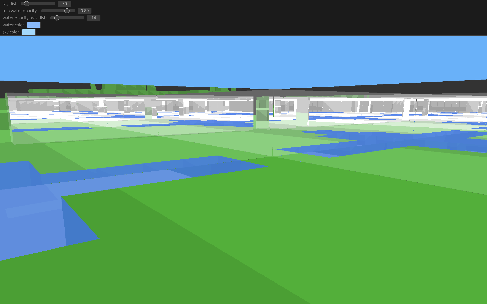

# Voxel Ray Tracing
Is a project I'm working on for rendering a voxel world, with ray tracing.

## Screenshots




## Running
In [releases](https://github.com/MasonFeurer/VoxelRayTracing/tree/main/releases), you can find binaries for MacOS.

Or you can build and run from source with:
```sh
git clone "https://github.com/MasonFeurer/VoxelRayTracing.git"
cd VoxelRayTracing
cargo run -r
```
