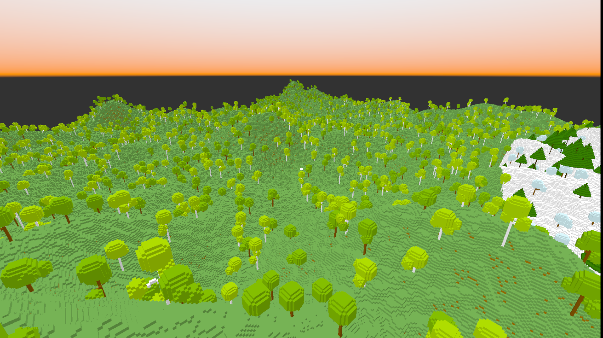
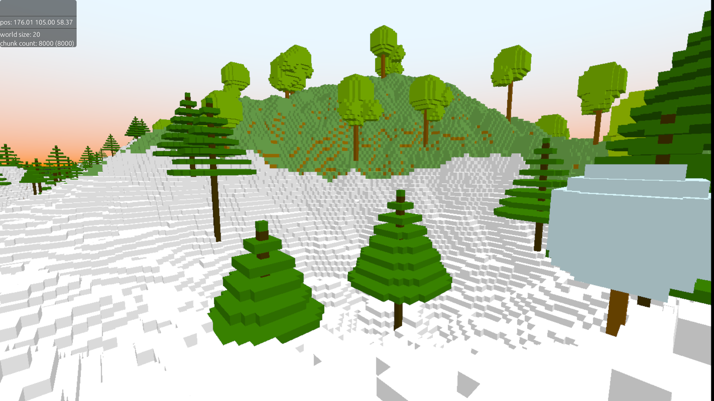

# Voxel Ray Tracing
Another Voxel Ray Tracing Engine, one with a creative name.
This project has the goal of creating an easy-to-use, "realistic" looking, smaller voxel engine.




# World
The world is organized into a grid of chunks 32x32x32 voxels in volume.
Each chunk stores it's voxels as an SVO (Sparse Voxel Octree) to optimize storage and rendering.

# Rendering
The rendering does not use any triangle mesh's. Intead, the raw SVO data is uploaded to the gpu, 
then the gpu casts a bunch of Ray's from the camera position into the world, using a partly-hand-crafted
algorithm for stepping through an SVO world efficiently. 

This rendering technique also makes it trivial to implement real-time light path-tracing to greatly improve the
visuals.

# How to Run the Engine
You will need to download from github and have `cargo` (the rust build tool).
```sh
git clone "https://github.com/MasonFeurer/VoxelRayTracing.git"
```

This engine will have 2 seperate programs you need to run: the server, and the client.
So in one terminal, run the server with:
```sh
cd VoxelRayTracing/servercli
cargo r -r ../stdrespack 60000
```

Then run the client in another terminal:
```sh
cd VoxelRayTracing/clientdesktop
cargo r -r ../stdrespack username 60000
```
