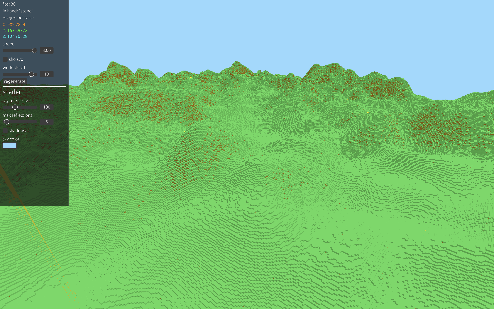

# Voxel Ray Tracing
My voxel rendering engine that makes use of ray tracing.

## Screenshots





## Running
In [releases](./releases), you can find binaries for MacOS.

Or you can build and run from source with:
```sh
git clone "https://github.com/MasonFeurer/VoxelRayTracing.git"
cd VoxelRayTracing
rustup default nightly
cargo run --release
```
