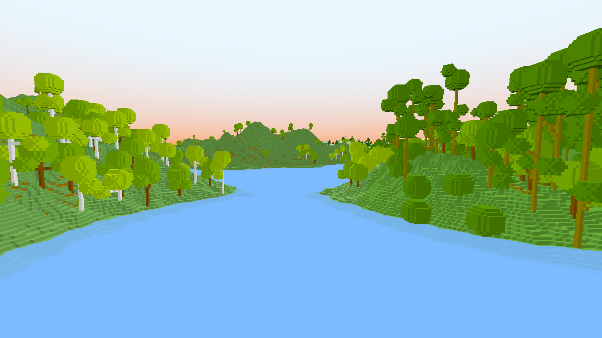
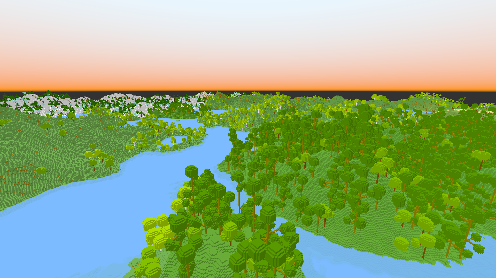
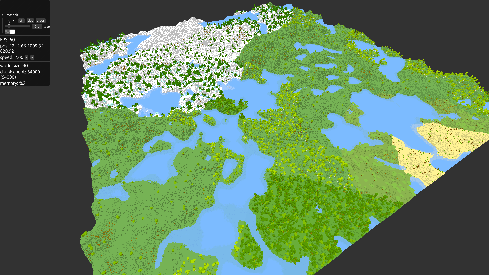

# Voxel Ray Tracing
Another Voxel Ray Tracing Engine, one with a creative name.
This project has the goal of creating an easy-to-use, "realistic" looking, smaller voxel engine.





# World
The world is organized into a grid of chunks 64x64x64 voxels in volume.
Each chunk stores its voxels as an SVO (Sparse Voxel Octree) to optimize storage and rendering.

# Rendering
The rendering does not use any triangle-meshes. Instead, the raw SVO data is uploaded to the gpu; 
then the gpu casts a bunch of rays from the camera position into the world, using a partly-hand-crafted
algorithm for stepping through an SVO world efficiently. 

This rendering technique also makes it trivial to implement real-time light path-tracing to greatly improve the
visuals.

# How to Play
Play the game with 3 simple steps.

1. Download the git project using this bash command:
    ```sh
    git clone "https://github.com/MasonFeurer/VoxelRayTracing.git"
    cd VoxelRayTracing
    ```
2. Run the installer to set up the game folder:
    ```sh
    cargo run --bin blockworld-installer
    ```
3. Build and run the game from source:
    ```sh
    cargo run --release --bin blockworld-client-desktop
    ```